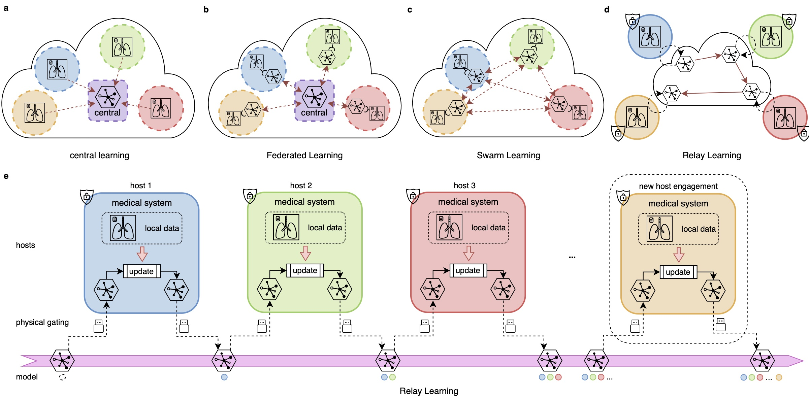

# Relay Learning: a Topologically Secure Framework for Clinical Multi-site Deep Learning

This is the official code repository for the Relay Learning project: [https://doi.org/10.1038/s41746-023-00934-4](https://doi.org/10.1038/s41746-023-00934-4).

Relay Learning is an offline deep learning paradigm providing topological data security
in multi-site medical artificial intelligence (AI).
Its a topologically secure multi-site deep learning framework that disconnects the entire medical system physically
away from outside interlopers, while still being able to build effective deep learning models by multi-site data.



## Requirements

The code is written in python3 and there are some dependencies which can be installed using pip or conda.
We list some important dependencies below, and you may want to install others when running the code.
These versions were tested on an Ubuntu 20.04 machine with 4 GTX 3090 gpus.
But since most of the dependencies are cross-platform,
you can easily deploy it to your own machine with other similar versions.

* pytorch 1.11.0 (with cuda 11.0 and cudnn 8.0.5)
* torchvision 0.12.0
* pytorch-lightning 1.3.5
* torchmetrics 0.6.0
* imgaug 0.4.0
* pillow 8.4.0
* SimpleITK 2.1.0
* matplotlib 3.4.3

## Data

In our paper, we used three datasets - Retina Fundus, Mediastinum tumor, and Brain Midline datasets.
The Retina Fundus dataset is from a public open dataset, which can be downloaded from
[DoFE](https://github.com/emma-sjwang/Dofe) (F1-F4)
and [Kaggle](https://www.kaggle.com/datasets/sshikamaru/glaucoma-detection) (F5).
The Mediastinum tumor dataset can be required by contacting our first or corresponding Author with reasonable purpose.
The Brain Midline dataset will not be released due to privacy issue.

If you want to use the Retina Fundus dataset to run our code, you can download it and place it in a folder on your
device.

## Config files

We treat data in each clinical site as a "task".
The definition and other configs of all the tasks is contained in a single config yaml file in `configs` folder.
The config file support both mimic training in a single node with all data (`configs/fundus/relay.yaml`)
and really deployed to local sites (`configs/fundus/relay_deploy.yaml`).
This flexibility is implemented in the "current_tasks" field in a config file.

We also present some other example config files on the Retina Fundus dataset.

Some baselines:

* `configs/others/local.yaml`: mimic local learning at each site.
* `configs/others/joint.yaml`: mimic joint learning where all data is jointly trained in a single host.
* `configs/others/sequential.yaml`: mimic sequential baseline learning where model is fine-tuned sequentially
  across sites without Relay Learning strategy.

For the Retina Fundus dataset, replace the "root_path" of the "dataset" field in the config file
with the path to the folder containing the downloaded data.

## Simple test

You can use our trained model (`fundus-Relay.ckpt`) using Relay Learning on Retina Fundus dataset downloaded from the
release page.
Change its name to 'last.ckpt' and put it to `exps/fundus/relay_test/test/checkpoints/task_4/last.ckpt`.
Run the following code to evaluate it:

```
python predict_test.py -c=fundus/relay_test -n=test -g=0
```

The evaluation result will be saved to `exp/fundus/relay_test/test/test_results`.

## Train on your own

Still take the Retina Fundus dataset as an example,
while you can train on your own dataset by creating your config ymal file
and write your torch dataset class in `datasets` folder.
Place the dataset to the correct path and run:

```
python train.py -c=fundus/relay -n=version_0 -g=0
```

The training log can be viewed using tensorboard in `exp/fundus/relay/version_0/tensorboard_summary`.
After the training finished, you can use the `predict_test.py` to test as mentioned above.
Note that the Dice metric in the training log is averaged voxel-wise,
which may be slightly different from the paper (averaged sample-wise).
You can use the `predict_test.py` to evaluate the sample-wise metric.

## Deploy to multiple sites

Prepare a config file like `configs/fundus/relay_deploy.yaml` in each site.
Configure the data path and model save path in the config file.
Then you can copy the model from previous site to next site and run the Relay Learning procedure.

## Code structure

* `configs`: store config yaml files that can be arranged in any directory structure.
* `datasets`: contains the torch dataset classes.
* `models`: contains the basic deep learning models which is used to do the specific medical tasks, such as U-Net.
* `strategies`: contains the multi-site learning strategies, including Relay Learning strategy.
* `losses`: contains the loss functions used in the training.
* `utils`: contains the utility functions used in the training.

## Cool features

The config file and argument of the command line run file supports some cool features that is easily accomplished:

* cross-platform: you can run the code on different systems like Windows, Mac or Linux.
* multiple devices: the code directly supports multiple GPUs or only CPU.
* multiple nodes: you can also easily extend the training to multiple machines/nodes via Pytorch-Lightning.
* flexible extensions: you can easily extend the framework to other datasets, models and multi-site strategies using our
  interface and base class.
* flexible configs: you can easily define most of your situations in multi-site deep learning by modifying a single
  config file.

## Cite
```
@article{bo2023relay,
  title={Relay learning: a physically secure framework for clinical multi-site deep learning},
  author={Bo, Zi-Hao and Guo, Yuchen and Lyu, Jinhao and Liang, Hengrui and He, Jianxing and Deng, Shijie and Xu, Feng and Lou, Xin and Dai, Qionghai},
  journal={npj Digital Medicine},
  volume={6},
  number={1},
  pages={204},
  year={2023},
  publisher={Nature Publishing Group UK London}
}
```
